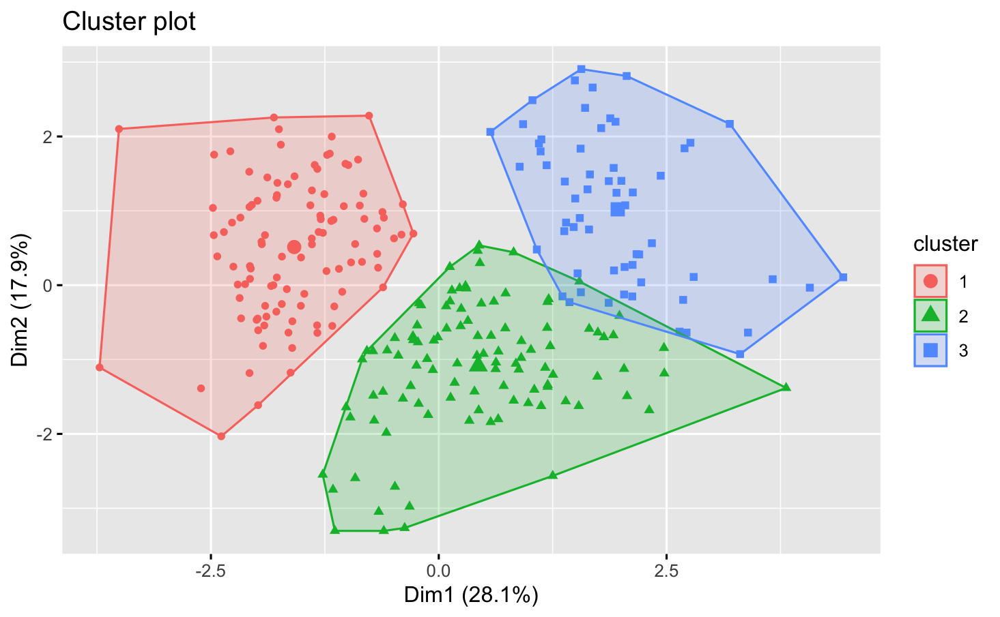
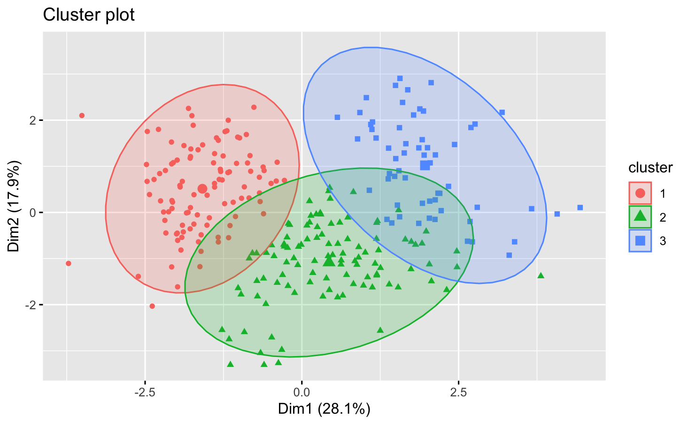

---
output:
  html_document: default
  pdf_document: default
  word_document: default
---

# Clustering for diabetes

```{r, echo=FALSE, message=FALSE}
library(ggplot2)
library(tidyr)
library(factoextra)
library(flexclust)
library(fpc)
library(clustertend)
library(cluster)
library(ClusterR)
library(tidyverse)
library(dendextend)
library(rstudioapi)
library(tidyr)
library(lubridate)
library(stats)
library(htmltools)
```

The aim of the study was to determine groups of woman who are suffering from diabetes based on some of their characteristics. To do that the database from the National Institute of Diabetes and Digestive and Kidney Diseases was used. It collected data from woman over 21 years old. It is also worth to mention that it was constructed in 1990. For study conduction the K-Means method was used. It allowed to group acquired observations into clusters and than examine their characteristics. This kind of analysis helped with determining profiles of women who are suffering from diabetes.

## Exploratory data analysis

```{r}
diabetes = read.csv("diabetes.csv")
diabetes = diabetes[which(diabetes$Outcome==1),]
diabetes = diabetes[seq(1,8)]
diabetes_id = diabetes
diabetes_id$id = seq.int(nrow(diabetes_id))
```

### Data standarization
It was decided that the data should be standardized due to the fact that the scale of each variable differ among each other.

```{r}
diabetes_z = as.data.frame(lapply(diabetes,scale))
```

### Basic statistics of the data
```{r}
diabetes_descr = psych::describe(diabetes)
diabetes_descr
```

Data is constructed with eight variables which are considered as a factors that may cause diabetes. These are:

- Pregnancies - number of times being pregnant
- Glucose - plasma glucose concentration a 2 hours in an oral glucose tolerance test
- Blood Preasure - diastolic blood pressure 
- Skin Thickness - Triceps skin fold thickness
- Insulin - 2-Hour serum insulin
- BMI - body mass index
- Diabetes Pedigree Function 
- Age

For each of them basic descriptive statistics were calculated. They gave a general overview of the data which indicated a diversity of observations. It is also visible in histograms of the variables. 

```{r}
diabetes_z %>%
  gather(Info, value, 1:8) %>%
  ggplot(aes(x=value, fill=Info)) +
  geom_density(color="white") +
  facet_wrap(~Info, scales="free_x") +
  labs(x="Values", y="Frequency",
       title="Diabetes Data - Histograms") +
  theme_update(plot.title = element_text(hjust = 0.5))
```

Based on the histograms it is visible that most variables have some potential outliers. Moreover, some of them look similar to the normal or log-normal distribution. 

## Introduction to clustering

### K-Means Method

K-Means is one of the most commonly used method in researches related to clustering. There are multiple reasons for its popularity. First of all its huge advantage is the simplicity. Comparing it to other methods it is really easy to implement. Moreover, it is relatively efficient and flexible not only on small databeses but also on the big ones. Additionally, it should be pointed out that k-means method performs effectively which means that the data is divided into useful clusters. Despite all these advantages k-means also has some drawbacks. The most common is the failure to deal effectively with noises and outliers. The other disadvantage is that the researcher needs to reasonably guess the initial number of clusters. 
In this study the k-means method was used and and the reason for that was its simplicity and also lack of major outliers in collected data. Additionally, the problem with establishing initial number of clusters was solved by using elbow method and silhuette statistics, which are used in the next section. 

### Elbow method
```{r}
opt = Optimal_Clusters_KMeans(diabetes_z, max_clusters=10, plot_clusters = TRUE)
```

### Silhuette method
```{r}
opt = Optimal_Clusters_KMeans(diabetes_z, max_clusters=10, plot_clusters=TRUE, criterion="silhouette")
```

To determine optimal number of clusters two plots were constructed. The first one presents the variance explained by models with different numbers of clusters. The second one is similar but it uses the silhouette statistics. Based on the plots it was decided that three or six clusters should be chosen. Thus, the Calinsky-Harabasz Index was calculated which helped with making the final decision regarding optimal number of clusters.

```{r}
km3 = kmeans(diabetes_z, 3)
km6 = kmeans(diabetes_z, 6)
```

Calinsky Harabasz Index for 3 clusters: `r round(calinhara(diabetes_z, km3$cluster),digits=2)`
Calinsky Harabasz Index for 6 clusters: `r round(calinhara(diabetes_z, km6$cluster),digits=2)`

Based on these results the decision was made that three clusters should be taken into account in further analysis because the Calinsky Harabasz Index is higher for this case.

## Clustering 

### Sizes of the clusters
```{r}
diabetes_clusters = kmeans(diabetes_z, 3)
diabetes_clusters$size
```

It is visible that number of observation in each clusters is similar. It may suggest that we are able to distinguish three groups of diabetes who are characterized with different features that cause the disease. 

#### Clusters centres

In the tables below the centroids of each cluster were presented. Based on them it was possible to distinguish some general characteristics that describe obtained culsters.

```{r}
diabetes_clusters$centers
```

Based on these results some general conclusions were made and presented below:

Cluster 1: The first group of the diabetes is characterized by:
- relatively low blood pressure, 
- low skin thickness,
- low level of insulin,
- low BMI level
- low diabetes pedigree function,

Cluster 2: The second diabetes group is characterized by:
- small number of pregnancies,
- relatively low plasma glucose concentration,
- high skin thickness,
- high insulin level,
- high level of BMI
- low age.

Cluster 3: The third group of the diabetes is characterized by:
- high number of pregnancies,
- high level of the plasma glucose concentration,
- high level of the blood pressure,
- high insulin level,
- high age.

### Cluster plots

 



The plots give some general overview of how observations and their clusters are distributed. It might be observed that especially observations from the first cluster are differently dispersed from other two. However, clusters two and three might are definitely less different from each other. Further analysis will allow to make final conclusions regarding that.

### Cluster descriptive statistics

Below, some descriptive statistics of the clusters were presented. 

```{r}
diabetes$cluster = diabetes_clusters$cluster
diabetes%>%                               
  split(.$cluster) %>%
  map(summary)
```

## The quality analysis of clustering

### Hopkins statistic

The Hopkins statistic of this dataset is rather low. According to the theory the statistic takes value from zero to one and as it is closer to one the dataset is more clusterable. Thus, the result might give an impression that the dataset is not perfectly clusterable.

```{r}
hopkins(diabetes_z, n=nrow(diabetes_z)-1)
```
 

### The ordered dissimilarity matrix

The other useful tool for measuring quality of the clustering is the ordered dissimilarity matrix Based on the theory when the blocks in the plot are visible the data set is clusterable. Thus, the result might give an impression that collected dataset is clusterable.

```{r}
di = dist(diabetes_z)
di = get_dist(diabetes_z, method="euclidean")
fviz_dist(di, show_labels = FALSE)+ labs(title="Diabetes")
```

### Shadow statistics

The next statistics which helped with determining quality of clustering was Shadow statistics. In this case the results were relatively high which might give an impression that point are rather equidistant to the two centroids rather than close to one centroid. 

```{r, message = FALSE}
d1 = cclust(diabetes_z, 3, dist="euclidean")
shadow(d1)
```

```{r}
plot(shadow(d1))
```

### Duda Hart Test

The last test that was run in the research was the Duda Hart test. Based on its results it is possible to determine  homogeneity or heterogeneity of clusters. In the research this results revealed that obtained clusters are heterogeneous because the p-value of the statistic is equal to 0.

```{r}
dudahart2(diabetes_z, km3$cluster)
```

## Conclusion

In general the research provides couple of new information about women suffering from diabetes. Based on its results it was possible to divide women into three groups which were characterized with different features. Their analysis allowed to create three profiles of diabetes. So, the first group represented by cluster number one might be regarded as a strangest one due to the fact that at the first glance their average characteristics do not indicate that those women are prone to have a diabetes. They are described with low BMI level, relatively low blood pressure and low diabetes pedigree function. However, there is one statistics which might indicate the reason that this group has diabetes and it is the insulin level which is significantly lower in comparison to other groups. That might indicate that those women are suffering from type 1 diabetes. By looking at the insulin statistics for this cluster it is noticeable that the group median is equal to 0 which supports previous suspicions. Based on these observations the first conclusion was made. Due to the fact that the cause of having type one diabetes is usually genetics, the first profile was named this way.

The second cluster was distinguished by high BMI level, high insulin level and high skin thickness. Those characteristics are typical for people suffering from type two diabetes. Additionally, it should be pointed out that this group is characterized with relatively low age (average 29 years old) which might be caused by new eating habit among young people in 90s. Thus, the second profile was described as the young women with eating disorders.

The third profile arose from the third cluster. Again, the group was characterized with high insulin level and additionally with high blood pressure which indicated that those people also suffer from type two diabetes. However, this group was also characterized with high age and high number of pregnancies. Thus, it might be suspected that this cluster is created mostly by women who were multiple times pregnant. And this result is not surprising as it is proven that the pregnancy increases the chances that women will have diabetes. This observations led to the third profile creation which was described as women who was pregnant before. 

Additionally, in this study the quality analysis of clustering was made. It did not provide any specific results and conclusions because they depended on multiple tests which gave opposite results. The Hopkins statistics and Shadow statistics indicated that the data set is not perfectly clusterable. On the other hand, the ordered dissimilarity matrix and Duda-Hart test pointed to the opposite conclusions. Despite the fact that it was impossible to obtain clear conclusion regarding test quality the results provided valuable information which have a background in the literature.

## References

https://uc-r.github.io/kmeans_clustering

https://www.geeksforgeeks.org/clustering-in-r-programming/

https://www.datacamp.com/community/tutorials/k-means-clustering-r

